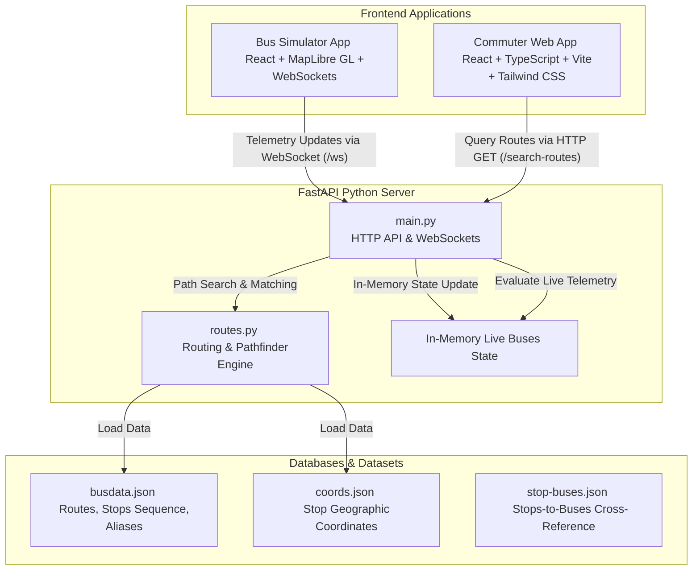

# RouteWise 🗺️🚌

**RouteWise** is a modern, real-time public transit routing, planning, and simulation workspace. The application enables commuters to find the optimal direct or single-transfer bus routes, tracks vehicle movements in real time, and dynamically scores routes using multi-criteria classification tags (Recommended, Fastest, Calmest, and Cheapest).

Currently, the project is **Kolkata-based only**. The long-term plan is to deploy physical tracking hardware on every bus in Kolkata to track live GPS and crowd status telemetry and send it directly to the server. Since the physical hardware tracking module is not yet implemented, a companion simulation application is used to simulate virtual bus movements so we can showcase how the ecosystem reacts to live bus telemetry.

---

## 🔗 Live Links

* **Commuter Web App:** [https://route-wise-app.vercel.app](https://route-wise-app.vercel.app)
* **Bus Simulator App:** [https://route-wise-simulation.vercel.app](https://route-wise-simulation.vercel.app)

### 💡 How to Test the Live App
To experience the real-time capabilities of RouteWise:
1. Open the **Bus Simulator App** (`https://route-wise-simulation.vercel.app`).
2. Spawn the relevant buses to start generating and streaming virtual real-time movements.
3. **Keep the simulation page open** in your browser so it continues to broadcast updates.
4. Open the **Commuter Web App** (`https://route-wise-app.vercel.app`) in a separate tab to search routes and view the live tracking and crowd status.

---

## 🏗️ Architecture Overview

RouteWise is designed as a modular, three-tier ecosystem consisting of a reactive web client, a high-performance pathfinding backend, and an interactive bus simulator.



---

## 📁 Project Directory Structure

```
RouteWise/
├── app/                  # Commuter React web app (Route searching, planner interface, and results dashboard)
├── server/               # Python FastAPI backend server (HTTP endpoints, WebSocket server, and routing algorithms)
├── simulation/           # Live Simulator React app (Interactive map showcasing real-time bus movements)
├── datasets/             # Source data files containing route sequences, stop coordinates, and alias mappings
├── routewise.code-workspace # Multi-root VS Code workspace configuration
└── GEMINI.md             # Development standards and guidelines for this repository
```

---

## ⚡ Key Features & Mechanics

### 1. Smart Pathfinder Engine (`server/routes.py`)
Calculates paths between any starting stop and destination stop:
* **Direct Routes:** Identifies buses that cover both locations sequentially.
* **1-Transfer Routes:** Searches for overlapping connection points between routes to suggest a single-transfer journey.
* **Alias Resolution:** Automatically normalizes human-entered names into canonical stop names (e.g. mapping aliases to standard system stop IDs).

### 2. Multi-Criteria Route Classifier (`server/main.py`)
Routes that are active are dynamically parsed and assigned badges to help passengers make quick decisions:
* ⭐ `RECOMMENDED`: Automatically selected as the overall balanced choice.
* ⚡ `FASTEST`: Evaluates the minimum duration (commute duration + boarding wait times).
* 🛡️ `CALMEST`: Picked based on `LOW` crowd occupancy status.
* 🐷 `CHEAPEST`: Finds the route with the lowest computed ticket fare.

### 3. WebSocket Real-Time Sync (`server/main.py`)
* The simulator connects via `/ws` and streams telemetry data such as coordinates, speed, current stops, crowd status, and active route codes.
* Telemetry messages are merged and updated in memory.
* When a bus turns off or finishes its run, a delete action is dispatched:
  ```json
  { "id": "bus-unique-uuid", "action": "delete" }
  ```

### 4. Interactive Simulation Visualizer (`simulation/`)
* Uses **MapLibre GL** for mapping rendering.
* Utilizes **CartoDB Positron (Light)** and **Dark Matter (Dark)** vector tiles stylesheets to avoid API keys and provide a beautiful, performant map out-of-the-box.
* Renders real-time markers representing buses moving along geographical line paths.

---

## 🚀 Setup & Execution

### Prerequisites
* **Python**: `3.10` or higher
* **Node.js**: `18.x` or higher
* **Package Manager**: `pnpm` (configured for workspace-level execution)

---

### 1. Backend Server Setup

Navigate into the `/server` directory:

1. **Create and Activate a Virtual Environment:**
   ```bash
   python -m venv venv
   source venv/bin/activate  # On Windows, use venv\Scripts\activate
   ```

2. **Install Dependencies:**
   ```bash
   pip install -r requirements.txt
   ```

3. **Run the Server:**
   ```bash
   fastapi dev main.py
   # Or using uvicorn:
   # uvicorn main:app --reload --port 8000
   ```

The backend server runs locally at: `http://localhost:8000`.

---

### 2. Commuter App Setup

Navigate into the `/app` directory:

1. **Install Dependencies:**
   ```bash
   pnpm install
   ```

2. **Configure Environment Variables:**
   Copy the example file to `.env`:
   ```bash
   cp .env.example .env
   ```
   Verify that `VITE_SERVER_URL` points to your backend instance:
   ```env
   VITE_SERVER_URL=http://localhost:8000
   ```

3. **Launch Development Server:**
   ```bash
   pnpm dev
   ```

The app will be active at: `http://localhost:5173`.

---

### 3. Simulator Setup

Navigate into the `/simulation` directory:

1. **Install Dependencies:**
   ```bash
   pnpm install
   ```

2. **Configure Environment Variables:**
   Copy the example file to `.env`:
   ```bash
   cp .env.example .env
   ```
   Verify that the URL points to your running backend:
   ```env
   VITE_SERVER_URL=http://localhost:8000
   ```

3. **Launch Simulator:**
   ```bash
   pnpm dev
   ```

The simulator will be active at: `http://localhost:5174` (or the next available port).

---

## 📊 Dataset Structure
The system relies on JSON files located under `server/` (and archived in `datasets/`):
* `busdata.json`: Defines routes (`code`, `kind`, `stops`) and `aliases` mapping dictionary.
* `coords.json`: Geolocation mappings mapping `Stop Name` -> `[Latitude, Longitude]`.
* `stop-buses.json`: Reverse lookup map connecting stop names to a list of matching bus codes running through them. Can be re-generated using `python rough.py`.
